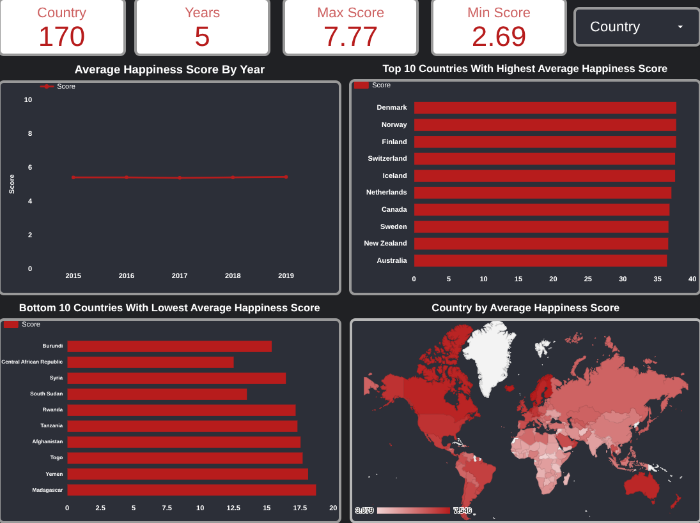
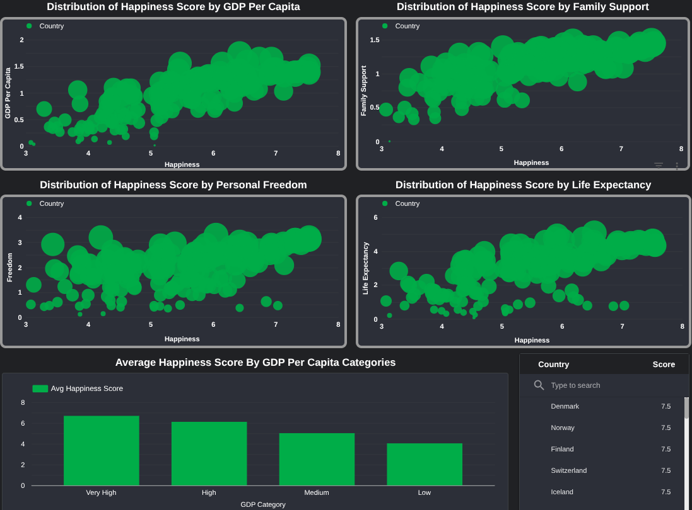

# 🌍 Exploratory Data Analysis of the World Happiness Report (2015–2019)

## 📌 Project Overview 

This project analyzes the **World Happiness Report (2015–2019)** to understand happiness levels across countries and identify the factors that contribute most to overall happiness scores.

The project follows a professional end-to-end workflow. Python was used to import and combine datasets from different years, explore the data, and uncover correlations and key insights. Looker Studio was then used to build an interactive dashboard to visualize and communicate these findings effectively.

## 📁 Dataset 

- ***About***: The world happiness report is an annual survey published by United Nations measuring happiness levels across countries.
Happiness scores are based on the Cantril Ladder - self-reported scale where respondents rate their lives from 0 to 10 .
The dataset includes six contributing factors: GDP per Capita, Family Support, Life Expectancy, Freedom, Generosity, and Corruption Perception. These factors explain why some countries rank higher than others, but are not direct inputs to the score it self.

- ***Source***: 'https://www.kaggle.com/datasets/unsdsn/world-happiness'
- ***Time Period***: Between 2015 and 2019
- ***Tables***: 5

## Dataset Features 

- `Country`            : Name of the country.

- `Score`              : A metric measured  by asking the sampled people the question:  "How would you rate your happiness

- `GDP_per_Capita`     : The extent to which GDP contributes to the calculation of the Happiness Score.

- `Family_Support`     : The extent to which Family contributes to the calculation of the Happiness Score

- `Life_Expectancy`    : The extent to which Life expectancy contributed to the calculation of the Happiness Score

- `Freedom`            : The extent to which Freedom contributed to the calculation of the Happiness Score.

- `Corruption_Perception` : The extent to which Perception of Corruption contributes to Happiness Score.

- `Generosity`         : The extent to which Generosity contributed to the calculation of the Happiness Score.

## 🎯 Objectives

- Analyze happiness levels across different countries.
- Identify the key factors influencing happiness scores.
- Compare the characteristics of the happiest and least happy countries.

## 📁 Project Structure

world-happiness-report-eda/

│

├── aggregations

│   ├── combined_world_happiness_data.csv

│   ├── country_avg.csv

│   ├── gdp_category_happiness.csv

│   └── yearly_avg.csv

│   
├── data/            # Raw CSV files (2015–2019)

│   ├── 2015.csv

│   ├── 2016.csv

│   ├── 2017.csv

│   ├── 2018.csv

│   └── 2019.csv
│

├── notebooks/

│   └── world_happiness_eda.ipynb  # Main analysis notebook

│

├── dashboard/

│   ├── page1.png            # Dashboard screenshot — overview

│   └── page2.png            # Dashboard screenshot — correlations

│

└── README.md

## ▶️ How to Run

1. **Clone the repository**

 git clone https://github.com/abdelhakmorhlia01-hub/world-happiness-report-eda.git

cd world-happiness-eda

2. **Install dependencies**

 bashpip install pandas numpy matplotlib seaborn

3. **Launch the notebook**

 jupyter notebook notebooks/happiness_eda.ipynb

##   Analysis & Workflow

### 1. Data Loading

- Imported CSV data using Pandas.
- Standardized column names across years for consistency

## 2. Analysis

- Explored the countries with the highest and lowest happiness scores.
- Examined the factors contributing to happiness levels.
- Analyzed the variation in happiness scores across different years.

### 3. Data Visualization

Built an interactive Looker Studio dashboard to visualize:

- The variation in average happiness scores from 2015 to 2019.
- The top 10 and bottom 10 happiest countries based on average happiness scores.
- The distribution of happiness scores across countries around the world.
- The relationship between happiness scores and key factors such as GDP, freedom, life expectancy, and family support.

### 📸  Dashboard Preview

         

##  Live Dashboard

[View Interactive Dashboard](https://lookerstudio.google.com/reporting/8b024e3e-8639-444e-9b14-61bf1d8ce1a4)

## 🔎 Key Insights

- **GDP per capita, family support, life expectancy, freedom, and generosity** are positively related to happiness scores.

- Better economic conditions, stronger social support, good health, and personal freedom are associated with higher happiness levels.

- The **top 10 happiest countries**, particularly **Scandinavian countries**, consistently show high happiness scores and stable social and economic conditions.

- The **least happy countries** often face political instability and economic challenges.

- Global happiness scores remained relatively stable between 2015 and 2019, with minor year-to-year fluctuations.

- Overall, happiness is influenced by multiple social and economic factors.

## 🛠️ Tools Used

Python (Pandas, NumPy,Matplotlib,Seaborn)
Looker Studio
Git & GitHub

## 👤 Author

Name: Abdelhak Morhlia

LinkedIn: https://www.linkedin.com/in/abdelhak-morhlia-41366a396/

# __

If you found this project useful, feel free to ⭐ star the repository!Compartir

